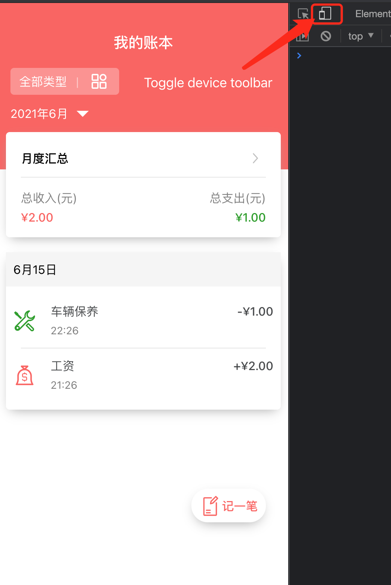

# Fancy Book

This project was bootstrapped with [Create React App](https://github.com/facebook/create-react-app).

Please find more about the thinking process at: [How I designed this App](./docs/how-I-designed-this-app.md).

## Dependencies

- OS: macOS Big Sur (Version: 11.4)
- [nvm](https://github.com/nvm-sh/nvm): lock project node version by [.nvmrc](./.nvmrc)

## Technologies

- [React](https://reactjs.org/): React and React Hooks
- [TypeScript](https://www.typescriptlang.org/) : a super set of javascript
- [Jest](https://jestjs.io/) : JavaScript Testing Framework
- [Husky](https://typicode.github.io/husky/#/): git hooks make life easier

## CI Pipeline

[Github Actions](https://github.com/hanpanpan200/account-book/actions)

## Interactive Prototype 

[FancyBook Prototype](https://v6.modao.cc/app/6f43d4201ca1893bce787d60a64cb27cc0f7a9fc?simulator_type=device&sticky)

## How to run

1. Lock node version

```
nvm install && nvm use
```

2. Install dependencies

```
npm install
``` 

3. Run in local environment

```
npm start
```

- Visit at: http://localhost:3000/
- Inspect
- `toggle device toolbar`




4. Run tests

```
npm test
```

## How to play

Please check this [showcase video](docs/videos/showcase.mp4) to know how to play with this FancyBook App.