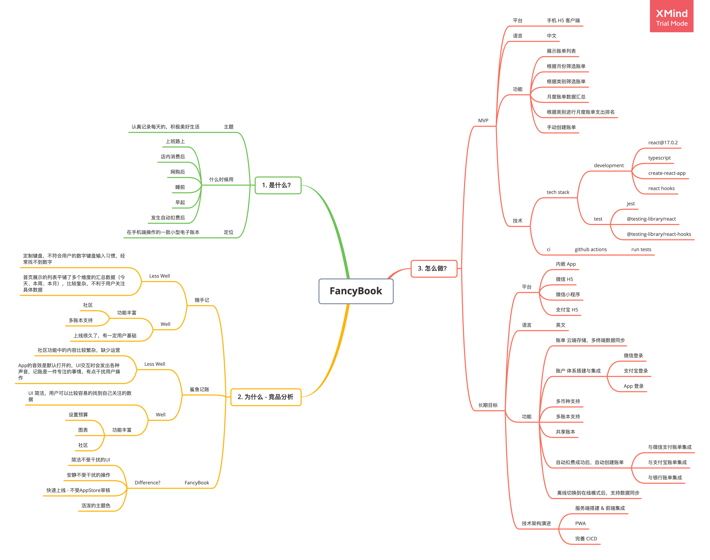
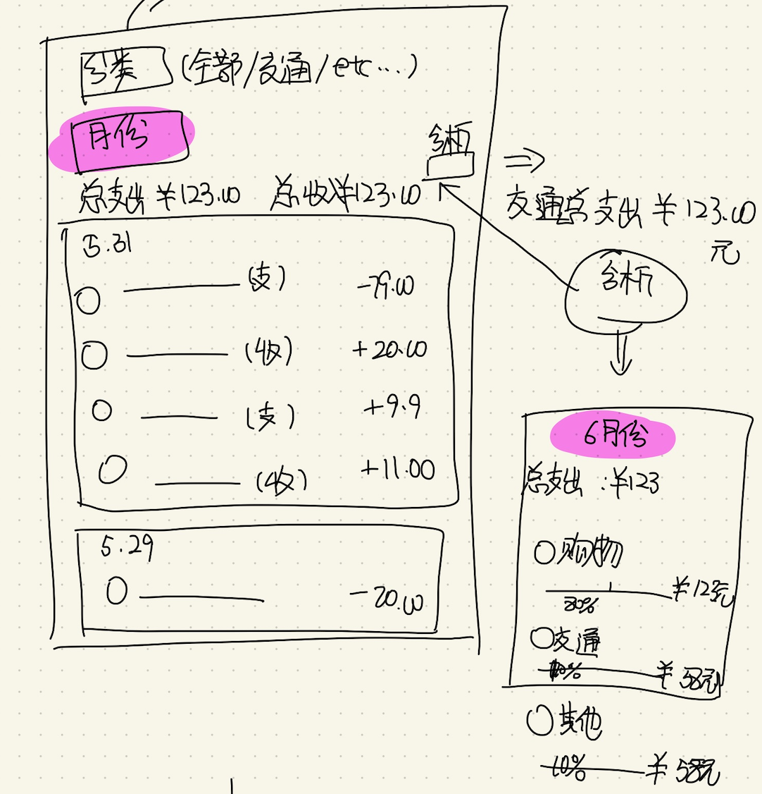
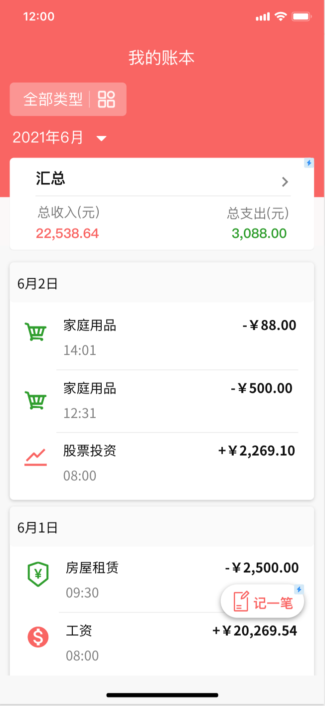
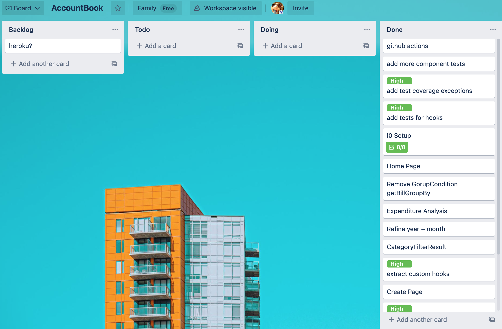
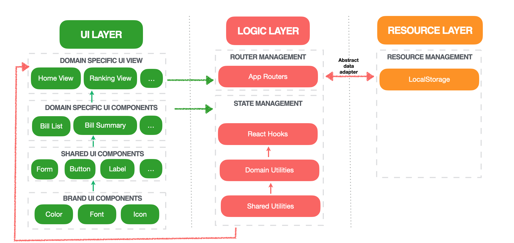

# 思考过程

首先，看完作业题目中的需求之后，我并没有马上开始动手写代码。我们做一个产品出来，不是为了纯粹追求技术上的爽，更是要思考：我这个产品/功能为用户带来了什么价值？

于是我带着这样一个问题，先在 XMind 中脑暴了一下。 

于是，便产生了下面的结构化的思路模型：

- 业务价值
- 产品亮点
- 基础需求点梳理
- 交互原型图设计
- 前端架构设计
- 前端代码编写及测试编写
- 产品与架构演进

## 是什么？

在这个过程中，我参考了一些竞品，例如随手记、鲨鱼记账 App，尝试提炼出自己产品的优势，并且确定了产品防线 - 一款小而够用的 Mobile Web App。

记账应该属于一个较私密的行为，我理解人还是倾向于在一个比较私密的设备上进行，于是认为，当前版本我们就基于手机端来做一个H5。

## 为什么 - FancyBook 的优势？

很多年前用过随手记，这么多年过去了，重新在手机上安装随手记App，我竟然有些失望。功能特别丰富，又大又全，
但就是让用户失去了关注点，找一个账单找了好久，UI交互和账单的筛选条件也较为复杂。

查了一下账单App的排名，发现鲨鱼记账的口碑还比较好，于是就下载试用了一下。刚开始试用点哪里都在发出声音，这真是一个劝退社恐青年的功能。、
可以想象出办公室里午休时，有人打开鲨鱼记账App记账时叮咚叮咚响的画面。这个声音是可以通过设置关掉的，可能它存在的意思就是让用户知道设置里有一个关闭它的选项吧。
除了声音之外，鲨鱼账单的 UI 非常清爽，过滤条件恰当，很容易就可以找到数据。

所以 Fancy App 的卖点是什么？我认为是：
- 随手记和鲨鱼记账都是 native app，上线要通过 AppStore 审核，但是我们的 Web App 却可以灵活上线。
同时在后期我们可以扩展成 [PWA(progressive web app)](https://web.dev/progressive-web-apps/) 来解决应用入口的问题。
- FancyApp目前的功能还比较少，所以当前可以专注 MVP 的功能，主打简单的UI，把组件、主题色确定下来，后期便可快速迭代。

## 怎么做 - 产品开发与演进

当前的 [MVP(minimum viable product)](https://www.agilealliance.org/glossary/mvp/) 阶段，6个主要 feature。

后来发现这6个feature和作业需求中的几点基本是吻合的，也意识到面试官辛苦了，出题也是经过了很多思考的！

### 设计

#### 灵魂画手的手稿图

#### 墨刀画的 prototype

### Task Management - Trello

在 Trello 中建了一些任务用来track进度

### 前端架构设计

## 遇到的问题及思考

### FancyApp 的技术亮点是什么？

FancyApp 的亮点是：

- 原子设计的组件化思路：从以上的前端架构设计图中可以看到，整个App的设计是由一层一层的组件来构成的。 最下层是颜色、字体，再向上是由这些颜色、字体构成的基本UI组件 Button, Label 等。
之后Button、Label等组件会构成有Domain逻辑的UI组件，比如 Bill List，最后Domain组件会组装成一个个业务页面。通用组件可在最大程度上复用，后期可抽成组件库。
  
- 数据抽象层 Abstract data adapter：抽象出统一的数据资源接口，后期可扩展到任意 resource provider。（当前为本地LocalStorage）。

### 关于抽象数据层的设计

在这个 App 中，为了在短时间内交付最有价值的功能，我暂时将数据直接放在了 `LocalStorage` 中存储。
但是随着产品演进，后续必然要搭建服务端，数据到时候会从服务端取。那么如何能留好一个扩展，使得在未来做迁移时不要太大费周章？
于是我做了一个数据的抽象层 Abstract data adapter，封装了一个 DataSourceAdapter 接口，将数据访问的接口格式定义好，`localStorageClient` 实现了这个接口，那么后期的服务端接口迁移，只需要再实现一个对应的 client 即可，资源层接口不变。

